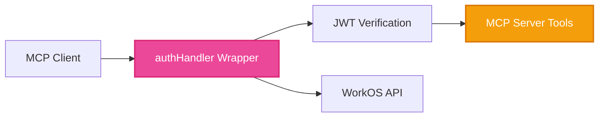

# Simple MCP Authentication Demo: Vercel AI SDK + WorkOS AuthKit

The **clearest and simplest** example of how to add enterprise authentication to MCP servers using the Vercel AI SDK and WorkOS AuthKit.

## What This Demo Shows

This demo shows how WorkOS integrates with the Vercel MCP adapter using three layers:

```typescript
// 1. Standard MCP server with business logic (Vercel MCP adapter)
import { createMcpHandler } from "@vercel/mcp-adapter";

const handler = createMcpHandler(
  (server) => {
    server.tool(
      "createExampleData",
      "Creates a new example data item",
      {
        name: z.string().min(1),
        description: z.string().min(1),
      },
      async ({ name, description }) => {
        // Pure business logic - no auth yet
        const newItem = {
          id: Math.random().toString(36).substr(2, 9),
          name,
          description,
          createdAt: new Date().toISOString(),
        };
        return {
          content: [{ type: "text", text: `Created: ${JSON.stringify(newItem)}` }],
        };
      }
    );
  }
);

export { handler as GET, handler as POST };
```

```typescript
// 2. Add WorkOS authentication with custom helpers
import { createMcpHandler, experimental_withMcpAuth } from "@vercel/mcp-adapter";
import { jwtVerify } from "jose";
import { ensureUserAuthenticated } from "./lib/auth/helpers"; // ← Our custom WorkOS helper
import { createExampleData } from "./lib/business/examples";

const handler = createMcpHandler(
  (server) => {
    server.tool(
      "createExampleData",
      "Creates a new example data item for the authenticated user",
      {
        name: z.string().min(1),
        description: z.string().min(1),
      },
      async ({ name, description }, extra) => {
        // Use our custom helper that wraps WorkOS user extraction
        const user = ensureUserAuthenticated(extra.authInfo);
        const newItem = await createExampleData({ name, description }, user);
        return {
          content: [{ 
            type: "text", 
            text: `Created for ${user.email}: ${JSON.stringify(newItem)}` 
          }],
        };
      }
    );
  }
);

// Direct WorkOS integration in verifyToken function
const verifyToken = async (req: Request, bearerToken?: string): Promise<AuthInfo | undefined> => {
  if (!bearerToken) return undefined;

  try {
    // Direct WorkOS JWT verification
    const { payload } = await jwtVerify(bearerToken, JWKS);
    
    // Direct WorkOS user management API call
    const user = await workos.userManagement.getUser(payload.sub);
    
    return {
      token: bearerToken,
      scopes: ["read:data", "write:data"],
      clientId: user.id,
      extra: { user, claims: payload } // WorkOS user context for our helpers
    };
  } catch (error) {
    return undefined;
  }
};

// Vercel adapter auth wrapper
const authHandler = experimental_withMcpAuth(handler, verifyToken, { 
  required: true,
  requiredScopes: ["read:data"],
});

export { authHandler as GET, authHandler as POST };
```

That's it! Your MCP server now has:
- ✅ Enterprise JWT authentication  
- ✅ Automatic user context in all tools
- ✅ SSO support (Google, Microsoft, SAML)
- ✅ Zero-config deployment to Vercel Edge

## Quick Start

### 1. Clone and Install
```bash
git clone https://github.com/workos/vercel-mcp-example.git
cd vercel-mcp-example
pnpm install
```

> **Note**: We recommend using `pnpm` as it handles React 19 peer dependency warnings gracefully. If using npm, add the `--legacy-peer-deps` flag.

### 2. Set Up WorkOS
1. Create a [WorkOS account](https://dashboard.workos.com) (free)
2. Create a new project  
3. Get your API Key and Client ID from the dashboard
4. Add `http://localhost:3000/callback` as a redirect URI in AuthKit settings

### 3. Configure Environment
```bash
cp .env.example .env.local
```

Fill in your WorkOS credentials:
```env
WORKOS_API_KEY=sk_test_your_api_key_here
WORKOS_CLIENT_ID=client_your_client_id_here
WORKOS_COOKIE_PASSWORD=your_32_character_secure_random_string
WORKOS_REDIRECT_URI=http://localhost:3000/callback
```

### 4. Start the Demo
```bash
npm run dev
```

Visit [http://localhost:3000](http://localhost:3000) to try the authenticated MCP server!

## How It Works

### The Demo MCP Server

The server in `app/mcp/route.ts` shows 5 example tools:

1. **`ping`** - Public tool (no auth required)
2. **`listExampleData`** - Get user's data (auth required)  
3. **`createExampleData`** - Create user data (auth required)
4. **`updateExampleData`** - Update user data (auth required)
5. **`getUserProfile`** - Get WorkOS user profile (auth required)

### Key Pattern: Custom WorkOS Helper Library

The `ensureUserAuthenticated` function is **our custom library function** that wraps WorkOS user extraction:

```typescript
// lib/auth/helpers.ts - Our custom WorkOS wrapper
export const ensureUserAuthenticated = (authInfo: AuthInfo | undefined): User => {
  if (!authInfo?.extra) {
    throw new Error('Authentication required for this tool');
  }
  
  // Extract WorkOS user from the authInfo.extra (set by our verifyToken function)
  const workosAuth = authInfo.extra as WorkOSAuthInfo;
  if (!workosAuth || !workosAuth.user) {
    throw new Error('Authentication required for this tool');
  }
  return workosAuth.user; // Return the WorkOS user object
};
```

This custom helper abstracts WorkOS user extraction and works seamlessly with the Vercel adapter:

```typescript
// In your MCP tools - use our custom WorkOS helper
server.tool("getUserData", {}, async (args, extra) => {
  // Our helper extracts the WorkOS user from Vercel adapter's authInfo
  const user = ensureUserAuthenticated(extra.authInfo); 
  const data = await getExampleData(user); // Use WorkOS user in business logic
  return { 
    content: [{ 
      type: "text", 
      text: `Found ${data.length} items for ${user.email}` 
    }] 
  };
});

// Optional auth with our helper
server.tool("ping", {}, async (args, extra) => {
  const authenticated = isAuthenticated(extra.authInfo); // Another custom helper
  return { 
    content: [{ 
      type: "text", 
      text: authenticated 
        ? `Hello ${extra.authInfo.extra.user.email}! 🔒` 
        : "Hello anonymous user! 🌍" 
    }] 
  };
});
```

### Three-Layer Integration

This demo shows three layers working together seamlessly:

1. **Vercel MCP Adapter**: Framework for MCP servers
2. **Direct WorkOS Integration**: JWT verification and user management in `verifyToken`
3. **Custom WorkOS Helpers**: Our library functions that abstract WorkOS complexity

```typescript
// Layer 1: Vercel MCP Adapter - standard MCP server
const handler = createMcpHandler((server) => {
  // Layer 3: Our custom helpers abstract WorkOS complexity  
  server.tool("listExampleData", {}, async (args, extra) => {
    const user = ensureUserAuthenticated(extra.authInfo); // ← Our custom WorkOS helper
    const data = await getExampleData(user);
    return { 
      content: [{ 
        type: "text", 
        text: `Found ${data.length} items for ${user.email}` 
      }] 
    };
  });
});

// Layer 2: Direct WorkOS integration in verifyToken
const verifyToken = async (req: Request, bearerToken?: string) => {
  // Direct WorkOS API calls
  const { payload } = await jwtVerify(bearerToken, JWKS);        // ← WorkOS JWT
  const user = await workos.userManagement.getUser(payload.sub); // ← WorkOS User API
  
  return { token: bearerToken, clientId: user.id, extra: { user, claims: payload } };
};

// Layer 1: Vercel adapter ties it all together
const authHandler = experimental_withMcpAuth(handler, verifyToken, { required: true });
```

**Result**: WorkOS enterprise authentication with clean abstractions that work perfectly with the Vercel MCP adapter.

## Testing the Demo

The web interface includes built-in testing tools:

1. **Test without login** - Try the `ping` tool (works)
2. **Login with WorkOS** - Use the login button  
3. **Test with login** - Try authenticated tools like `getUserProfile`

You can also test with any MCP client by configuring it to use your local server with a JWT token.

## Architecture



1. **MCP Client** sends request with JWT token
2. **authHandler** verifies JWT with WorkOS public keys
3. **WorkOS API** provides user profile and claims  
4. **MCP Tools** receive authenticated user context
5. **Response** includes user-specific data

## Code Organization

This template follows a recommended structure for scalable MCP servers:

```
lib/
├── auth/
│   ├── helpers.ts        # ensureUserAuthenticated, isAuthenticated
│   └── types.ts          # User, WorkOSAuthInfo types
├── business/
│   ├── examples.ts       # Example business logic (replace with yours)
│   └── database.ts       # Database connection/queries
├── mcp/
│   ├── tools/
│   │   ├── public.ts     # Public tools (ping, status)
│   │   └── examples.ts   # Example authenticated tools
│   └── server.ts         # Main MCP server setup
└── utils/
    ├── validation.ts     # Zod schemas
    └── errors.ts         # Custom error classes
```

### Key Files

- **`app/mcp/route.ts`** - The main MCP server with authentication
- **`lib/auth/helpers.ts`** - Authentication helper functions
- **`lib/business/examples.ts`** - Example business logic (replace with yours)
- **`lib/mcp/tools/`** - MCP tool definitions organized by category
- **`app/components/TestingSection.tsx`** - Built-in testing interface
- **`lib/with-authkit.ts`** - WorkOS AuthKit setup

## Next Steps

1. **Explore the code** - See how simple the pattern is
2. **Customize the tools** - Replace lib/business/examples.ts with your business logic  
3. **Deploy to production** - Just `vercel deploy` (environment variables needed)
4. **Add more auth features** - Role-based access, organization filtering, etc.

## Why This Stack?

- **Vercel AI SDK**: Type-safe MCP development with zero-config deployment
- **WorkOS AuthKit**: Enterprise authentication (SSO, user management, compliance)
- **Simple Pattern**: Business logic stays clean, security is declarative

Perfect for building AI tools that need real user authentication and enterprise features.

## Contributing

We welcome contributions to this project! Here's how you can help:

### Development Setup

1. Fork the repository
2. Clone your fork: `git clone https://github.com/YOUR_USERNAME/vercel-mcp-example.git`
3. Install dependencies: `pnpm install` (or `npm install --legacy-peer-deps`)
4. Create a branch: `git checkout -b feature/your-feature-name`
5. Make your changes and write tests
6. Run the test suite: `pnpm run test`
7. Run linting and formatting: `pnpm run lint && pnpm run prettier`
8. Push to your fork and submit a pull request

### Guidelines

- Write clear, concise commit messages
- Add tests for new functionality
- Ensure all tests pass before submitting
- Follow the existing code style and conventions
- Update documentation as needed

### Reporting Issues

Please use the [GitHub Issues](https://github.com/workos/vercel-mcp-example/issues) page to report bugs or request features.

## License

This project is licensed under the MIT License - see the [LICENSE](LICENSE) file for details.

---

**Questions?** Check the [WorkOS MCP docs](https://workos.com/docs/user-management/mcp) or [Vercel AI SDK docs](https://sdk.vercel.ai/docs/foundations/mcp).
