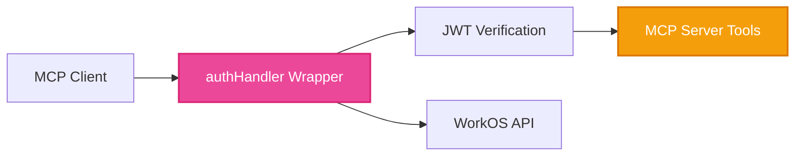

# Simple MCP Authentication Demo: Vercel AI SDK + WorkOS AuthKit

The **clearest and simplest** example of how to add enterprise authentication to MCP servers using the Vercel AI SDK and WorkOS AuthKit.

## What This Demo Shows

This demo illustrates the `authHandler` pattern - a simple wrapper that transforms any MCP server into an authenticated service:

```typescript
// 1. Build your MCP server (business logic)
const handler = createMcpHandler((server) => {
  server.tool('getUserData', {}, async (args, { authInfo }) => {
    const user = ensureUserAuthenticated(authInfo); // ← Get authenticated user
    return { userData: await getData(user.id) };    // ← Access user's data safely
  });
});

// 2. Add authentication (security wrapper)
const authHandler = experimental_withMcpAuth(
  handler,
  async (request, token) => {
    // Verify JWT and fetch user from WorkOS
    const { payload } = await jwtVerify(token, JWKS);
    const user = await workos.userManagement.getUser(payload.sub);
    
    return { token, clientId, scopes: [], extra: { user, claims: payload } };
  }
);

// 3. Expose authenticated MCP server
export { authHandler as GET, authHandler as POST };
```

That's it! Your MCP server now has:
- ✅ Enterprise JWT authentication  
- ✅ Automatic user context in all tools
- ✅ SSO support (Google, Microsoft, SAML)
- ✅ Zero-config deployment to Vercel Edge

## Quick Start

### 1. Clone and Install
```bash
git clone https://github.com/workos/vercel-mcp-example.git
cd vercel-mcp-example
npm install
```

### 2. Set Up WorkOS
1. Create a [WorkOS account](https://dashboard.workos.com) (free)
2. Create a new project  
3. Get your API Key and Client ID from the dashboard
4. Add `http://localhost:3000/callback` as a redirect URI in AuthKit settings

### 3. Configure Environment
```bash
cp .env.example .env.local
```

Fill in your WorkOS credentials:
```env
WORKOS_API_KEY=sk_test_your_api_key_here
WORKOS_CLIENT_ID=client_your_client_id_here
WORKOS_COOKIE_PASSWORD=your_32_character_secure_random_string
WORKOS_REDIRECT_URI=http://localhost:3000/callback
```

### 4. Start the Demo
```bash
npm run dev
```

Visit [http://localhost:3000](http://localhost:3000) to try the authenticated MCP server!

## How It Works

### The Demo MCP Server

The server in `app/mcp/route.ts` shows 5 example tools:

1. **`ping`** - Public tool (no auth required)
2. **`listExampleData`** - Get user's data (auth required)  
3. **`createExampleData`** - Create user data (auth required)
4. **`updateExampleData`** - Update user data (auth required)
5. **`getUserProfile`** - Get WorkOS user profile (auth required)

### Key Pattern: `ensureUserAuthenticated`

```typescript
// Helper function that ensures authentication
const ensureUserAuthenticated = (authInfo: any): User => {
  const workosAuth = authInfo?.extra as WorkOSAuthInfo;
  if (!workosAuth || !workosAuth.user) {
    throw new Error('Authentication required for this tool');
  }
  return workosAuth.user;
};

// Use in any tool that needs authentication
server.tool('protectedTool', {}, async (args, { authInfo }) => {
  const user = ensureUserAuthenticated(authInfo); // Throws if not authenticated
  // ... now safely use user.id, user.email, etc.
});
```

### Mixed Authentication Support

The demo shows how to support both public and private tools in the same server:

```typescript
// Public tool - anyone can call
server.tool('ping', {}, async (args, { authInfo }) => {
  const isAuth = isAuthenticated(authInfo); // Check without throwing
  return { message: isAuth ? 'Hello authenticated user!' : 'Hello world!' };
});

// Private tool - authentication required  
server.tool('getUserData', {}, async (args, { authInfo }) => {
  const user = ensureUserAuthenticated(authInfo); // Throws if not authenticated
  return { userData: await getUserData(user.id) };
});
```

## Testing the Demo

The web interface includes built-in testing tools:

1. **Test without login** - Try the `ping` tool (works)
2. **Login with WorkOS** - Use the login button  
3. **Test with login** - Try authenticated tools like `getUserProfile`

You can also test with any MCP client by configuring it to use your local server with a JWT token.

## Architecture



1. **MCP Client** sends request with JWT token
2. **authHandler** verifies JWT with WorkOS public keys
3. **WorkOS API** provides user profile and claims  
4. **MCP Tools** receive authenticated user context
5. **Response** includes user-specific data

## Code Organization

This template follows a recommended structure for scalable MCP servers:

```
lib/
├── auth/
│   ├── helpers.ts        # ensureUserAuthenticated, isAuthenticated
│   └── types.ts          # User, WorkOSAuthInfo types
├── business/
│   ├── examples.ts       # Example business logic (replace with yours)
│   └── database.ts       # Database connection/queries
├── mcp/
│   ├── tools/
│   │   ├── public.ts     # Public tools (ping, status)
│   │   └── examples.ts   # Example authenticated tools
│   └── server.ts         # Main MCP server setup
└── utils/
    ├── validation.ts     # Zod schemas
    └── errors.ts         # Custom error classes
```

### Key Files

- **`app/mcp/route.ts`** - The main MCP server with authentication
- **`lib/auth/helpers.ts`** - Authentication helper functions
- **`lib/business/examples.ts`** - Example business logic (replace with yours)
- **`lib/mcp/tools/`** - MCP tool definitions organized by category
- **`app/components/TestingSection.tsx`** - Built-in testing interface
- **`lib/with-authkit.ts`** - WorkOS AuthKit setup

## Next Steps

1. **Explore the code** - See how simple the pattern is
2. **Customize the tools** - Replace lib/business/examples.ts with your business logic  
3. **Deploy to production** - Just `vercel deploy` (environment variables needed)
4. **Add more auth features** - Role-based access, organization filtering, etc.

## Why This Stack?

- **Vercel AI SDK**: Type-safe MCP development with zero-config deployment
- **WorkOS AuthKit**: Enterprise authentication (SSO, user management, compliance)
- **Simple Pattern**: Business logic stays clean, security is declarative

Perfect for building AI tools that need real user authentication and enterprise features.

---

**Questions?** Check the [WorkOS MCP docs](https://workos.com/docs/user-management/mcp) or [Vercel AI SDK docs](https://vercel.com/docs/ai-sdk).
