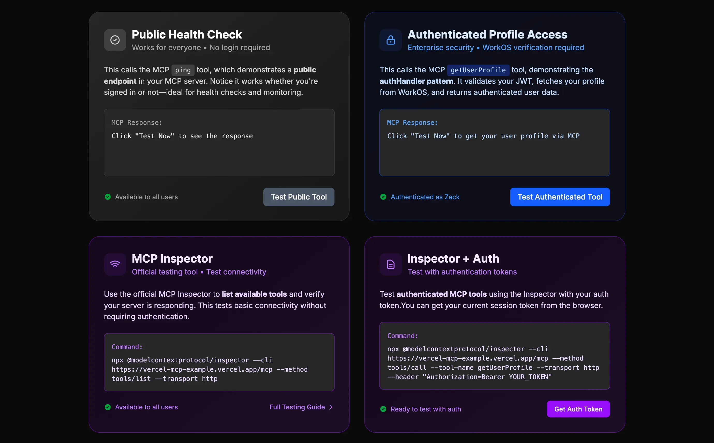
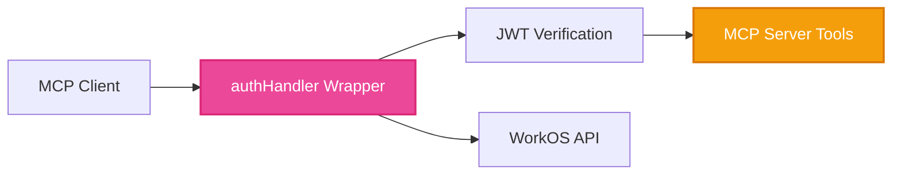

# MCP Authentication Demo: Vercel MCP Adapter + WorkOS AuthKit

A production-ready template for building authenticated MCP servers using the Vercel MCP adapter and WorkOS AuthKit. Clone this repo, add your tools, and deploy instantly to Vercel with enterprise authentication built-in.

## What This Demo Shows

**Core insight**: Individual tools decide if they need authentication. No global auth requirements, no complex middleware.

### The Pattern

```typescript
// Without auth: pure business logic
server.tool("publicData", {}, async () => {
  return getPublicData();
});

// With auth: same logic + one helper call
server.tool("userData", {}, async (args, extra) => {
  const user = ensureUserAuthenticated(extra.authInfo); // ← Just add this line
  return getUserData(user);
});
```

### How It Works

1. **Wrap your handler** with `withMcpAuth`:
```typescript
const authHandler = withMcpAuth(handler, verifyToken, { 
  required: false // ← Tools decide individually
});
```

1. **Verify tokens** with direct WorkOS calls:
```typescript
const verifyToken = async (req: Request, bearerToken?: string) => {
  if (!bearerToken) return undefined; // Allow unauthenticated requests
  
  const { payload } = await jwtVerify(bearerToken, JWKS);        // WorkOS JWT
  const user = await workos.userManagement.getUser(payload.sub); // WorkOS User API
  
  return { token: bearerToken, clientId: user.id, extra: { user } };
};
```

3. **Tools get user context** through our helper:
```typescript
// lib/auth/helpers.ts
export const ensureUserAuthenticated = (authInfo: AuthInfo | undefined): User => {
  if (!authInfo?.extra?.user) {
    throw new Error('Authentication required for this tool');
  }
  return authInfo.extra.user; // WorkOS user object
};
```

That's it! Your MCP server now has enterprise authentication with zero global auth logic.

<details>
<summary>See the complete implementation</summary>

```typescript
// app/mcp/route.ts - Complete authenticated MCP server
import { createMcpHandler, withMcpAuth } from "@vercel/mcp-adapter";
import { jwtVerify } from "jose";
import { ensureUserAuthenticated, isAuthenticated } from "../../lib/auth/helpers";

// Clean MCP handler - tools decide auth individually
const handler = createMcpHandler((server) => {
  // Public tool
  server.tool("ping", {}, async (args, extra) => {
    const authenticated = isAuthenticated(extra.authInfo);
    return { 
      content: [{ 
        type: "text", 
        text: authenticated ? "Hello authenticated user!" : "Hello world!" 
      }] 
    };
  });
  
  // Private tool - decides it needs auth
  server.tool("getUserProfile", {}, async (args, extra) => {
    const user = ensureUserAuthenticated(extra.authInfo); // Throws if not authenticated
    return { 
      content: [{ 
        type: "text", 
        text: `Profile: ${user.email} (${user.firstName} ${user.lastName})` 
      }] 
    };
  });
});

// WorkOS token verification
const verifyToken = async (req: Request, bearerToken?: string) => {
  if (!bearerToken) return undefined;
  
  try {
    const { payload } = await jwtVerify(bearerToken, JWKS);
    const user = await workos.userManagement.getUser(payload.sub);
    return { token: bearerToken, clientId: user.id, extra: { user, claims: payload } };
  } catch (error) {
    return undefined;
  }
};

// Authenticated handler
const authHandler = withMcpAuth(handler, verifyToken, { required: false });

export { authHandler as GET, authHandler as POST };
```

</details>

**Result**: Enterprise authentication with SSO support, automatic user context in tools, and zero-config Vercel deployment.

## Ready-to-Deploy Template

This isn't just a demo—it's a complete template you can build on:

- **Replace the example tools** in `lib/business/examples.ts` with your own business logic
- **Add new authenticated tools** using the same pattern shown above
- **Test everything locally** with the built-in web interface and testing tools
- **Deploy to Vercel** in one command with enterprise auth already configured

### Built-in Testing Interface

The template includes a complete testing interface so you can verify your tools work correctly:



Test both public and authenticated tools directly from your browser, with automatic token management and clear response formatting.

## Quick Start

### 1. Clone and Install
```bash
git clone https://github.com/workos/vercel-mcp-example.git
cd vercel-mcp-example
pnpm install
```

> **Note**: We recommend using `pnpm` as it handles React 19 peer dependency warnings gracefully. If using npm, add the `--legacy-peer-deps` flag.

### 2. Set Up WorkOS
1. Create a [WorkOS account](https://dashboard.workos.com) (free)
2. Create a new project  
3. Get your API Key and Client ID from the dashboard
4. Add `http://localhost:3000/callback` as a redirect URI in AuthKit settings

### 3. Configure Environment
```bash
cp .env.example .env.local
```

Fill in your WorkOS credentials:
```env
WORKOS_API_KEY=sk_test_your_api_key_here
WORKOS_CLIENT_ID=client_your_client_id_here
WORKOS_COOKIE_PASSWORD=your_32_character_secure_random_string
WORKOS_REDIRECT_URI=http://localhost:3000/callback
```

### 4. Start the Demo
```bash
npm run dev
```

Visit [http://localhost:3000](http://localhost:3000) to try the authenticated MCP server!

## Testing the Demo

The template includes a complete web interface for testing your MCP tools:

1. **Test public tools** - Try `ping` without authentication
2. **Login with WorkOS** - Use the login button to authenticate  
3. **Test authenticated tools** - Try tools like `getUserProfile` that require user context

The interface handles token management automatically and displays responses in a clean, readable format. You can also test with any MCP client by configuring it to use your local server.

## Architecture



Simple flow: Client → Auth wrapper → JWT verification → Tools decide if they need user context → WorkOS API (if needed).

## Code Organization

This template follows a recommended structure for scalable MCP servers:

```
lib/
├── auth/
│   ├── helpers.ts        # ensureUserAuthenticated, isAuthenticated
│   └── types.ts          # User, WorkOSAuthInfo types
├── business/
│   ├── examples.ts       # Example business logic (replace with yours)
│   └── database.ts       # Database connection/queries
├── mcp/
│   ├── tools/
│   │   ├── public.ts     # Public tools (ping, status)
│   │   └── examples.ts   # Example authenticated tools
│   └── server.ts         # Main MCP server setup
└── utils/
    ├── validation.ts     # Zod schemas
    └── errors.ts         # Custom error classes
```

### Key Files

- **`app/mcp/route.ts`** - The main MCP server with authentication
- **`lib/auth/helpers.ts`** - Authentication helper functions
- **`lib/business/examples.ts`** - Example business logic (replace with yours)
- **`lib/mcp/tools/`** - MCP tool definitions organized by category
- **`app/components/TestingSection.tsx`** - Built-in testing interface
- **`lib/with-authkit.ts`** - WorkOS AuthKit setup

## Next Steps

1. **Explore the code** - See how the authentication pattern works
2. **Build your tools** - Replace `lib/business/examples.ts` with your business logic  
3. **Test locally** - Use the built-in testing interface to verify everything works
4. **Deploy to production** - Run `vercel deploy` with your environment variables
5. **Add advanced features** - Role-based access, organization filtering, etc.

## Why This Stack?

- **Vercel MCP adapter**: Type-safe MCP development with zero-config deployment
- **WorkOS AuthKit**: Enterprise authentication (SSO, user management, compliance)
- **Simple Pattern**: Business logic stays clean, security is declarative

Perfect for building production AI tools that need real user authentication and enterprise features.

## Contributing

We welcome contributions to this project! Here's how you can help:

### Development Setup

1. Fork the repository
2. Clone your fork: `git clone https://github.com/YOUR_USERNAME/vercel-mcp-example.git`
3. Install dependencies: `pnpm install` (or `npm install --legacy-peer-deps`)
4. Create a branch: `git checkout -b feature/your-feature-name`
5. Make your changes and write tests
6. Run the test suite: `pnpm run test`
7. Run linting and formatting: `pnpm run lint && pnpm run prettier`
8. Push to your fork and submit a pull request

### Guidelines

- Write clear, concise commit messages
- Add tests for new functionality
- Ensure all tests pass before submitting
- Follow the existing code style and conventions
- Update documentation as needed

### Reporting Issues

Please use the [GitHub Issues](https://github.com/workos/vercel-mcp-example/issues) page to report bugs or request features.

## License

This project is licensed under the MIT License - see the [LICENSE](LICENSE) file for details.

---

**Questions?** Check the [WorkOS MCP docs](https://workos.com/docs/user-management/mcp) or [Vercel MCP adapter docs](https://sdk.vercel.ai/docs/foundations/mcp).
