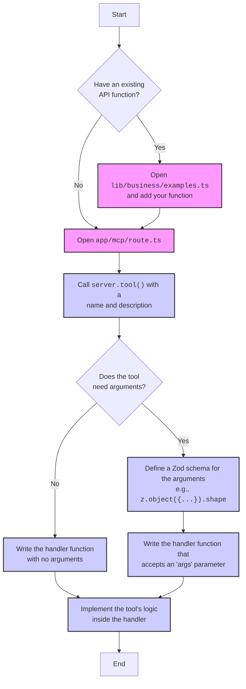

# Customization

This template is designed to be easily customizable. Here's how you can adapt it to your specific use case.

## Replacing the Example API

The core of the customization process is replacing the simulated API in `lib/business/examples.ts` with your own data-accessing functions.

1.  **Open `lib/business/examples.ts`:**

    This file contains functions like `getExampleData`, `createExampleData`, and `updateExampleData`.

2.  **Implement your own logic:**

    Replace the body of these functions with your own code to interact with your database, external API, or any other data source.

    For example, if you are using Prisma, your `getExampleData` function might look something like this:

    ```typescript
    import { prisma } from "@/lib/prisma";
    import { User } from "@/lib/auth/types";

    export const getExampleData = async (user: User) => {
      return await prisma.item.findMany({
        where: {
          userId: user.id,
        },
      });
    };
    ```

3.  **Adjust the data models:**

    Update the `ExampleData` interface to match the data model of your application.

## Adding New MCP Tools

You can add new tools to your MCP server by editing `app/mcp/route.ts`. The following flowchart outlines the process:



### 1. Open `app/mcp/route.ts`

This file contains the MCP server implementation.

### 2. Use the `server.tool` method

To add a new tool, call the `server.tool` method. It takes the following arguments:

- `name`: The name of the tool.
- `description`: A detailed description of what the tool does.
- `schema` (optional): A Zod schema for the tool's arguments.
- `handler`: An async function that implements the tool's logic.

Here's an example of a simple tool without arguments:

```typescript
server.tool("myNewTool", "This is a description of my new tool.", async () => {
  // Your logic here
  return {
    content: [
      {
        type: "text",
        text: "Hello from my new tool!",
      },
    ],
  };
});
```

And here's an example of a tool with arguments:

```typescript
server.tool(
  "add",
  "Adds two numbers together.",
  z.object({
    a: z.number(),
    b: z.number(),
  }).shape,
  async (args) => {
    const result = args.a + args.b;
    return {
      content: [
        {
          type: "text",
          text: `The result is ${result}`,
        },
      ],
    };
  },
);
```

## Configuring Permissions and Roles

The authHandler pattern provides each tool with an `authInfo` object that contains the authenticated user's information (see `ensureUserAuthenticated` in `lib/auth/helpers.ts`). You can use this to implement role-based access control (RBAC) or other permission models.

Here's an example of how you might protect a tool so that it can only be run by admin users:

```typescript
server.tool("adminDashboard", "Shows admin-only statistics.", async () => {
  // Assuming you have a custom attribute `role` on your WorkOS user
  if (authInfo.user.customAttributes?.role !== "admin") {
    return {
      content: [
        {
          type: "text",
          text: "You do not have permission to access this resource.",
        },
      ],
      isError: true,
    };
  }

  // Admin-only logic here
});
```

## Error Handling Patterns

It's important to provide clear and useful error messages to the MCP client. When an error occurs in your tool's handler, you can return an `isError: true` property in the response.

```typescript
server.tool("mayFail", "A tool that might fail.", async () => {
  try {
    // Some logic that might throw an error
    throw new Error("Something went wrong!");
  } catch (error) {
    const message =
      error instanceof Error ? error.message : "An unknown error occurred";
    return {
      content: [
        {
          type: "text",
          text: `Error: ${message}`,
        },
      ],
      isError: true,
    };
  }
});
```
